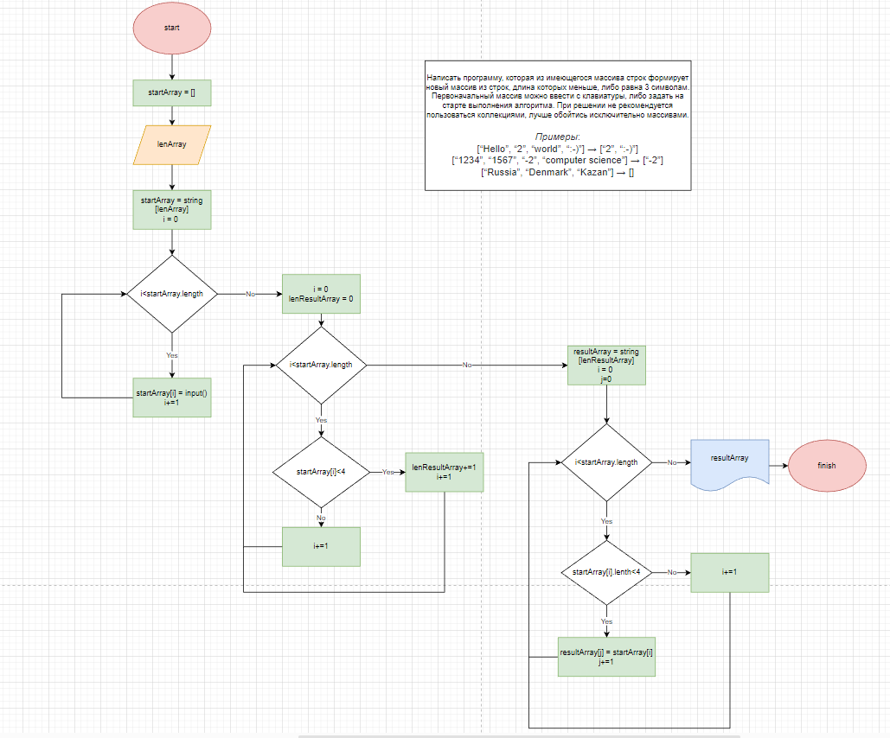

## План решения задачи ##
1. Создание метода, создающего имеющийся массив из строк (на вход подается количество элементов массива).
2. Создание метода, с помощью которого можно посчитать длину результирующего массива (т.е. сколько элементов имеют длину 3 и менее символов).
3. Создание метода, с помощью которого в результирующий массив будет идти добавление элементов первоначального массива с длиной элемента 3 и менее символов. 

## Блок-схема решения задачи ##

В блок-схеме решения задачи описаны все 3 метода.

